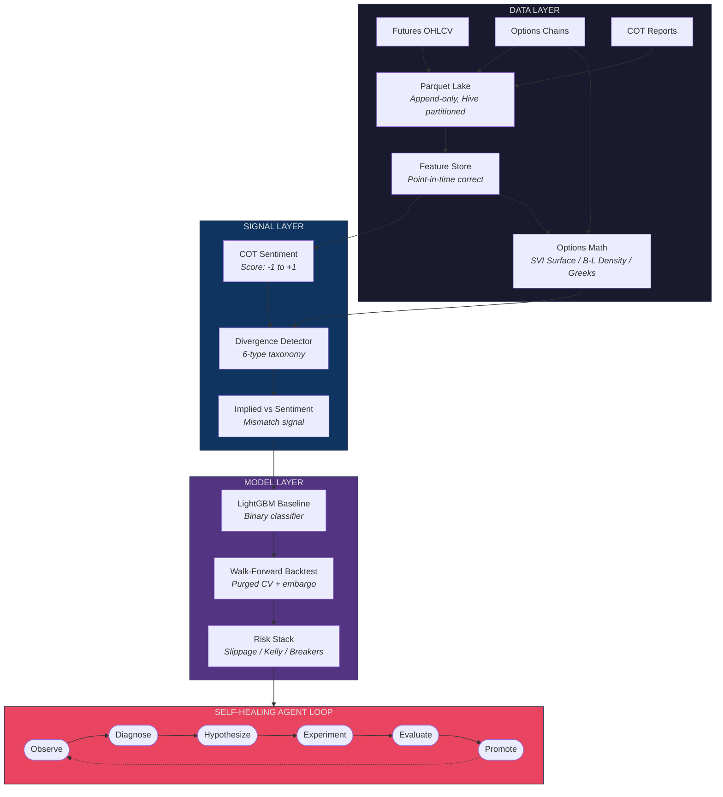
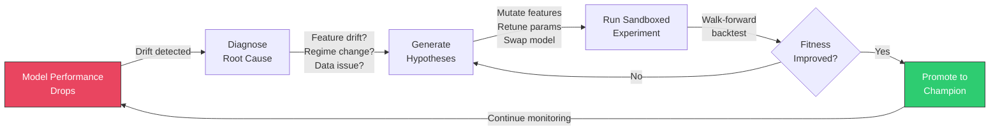
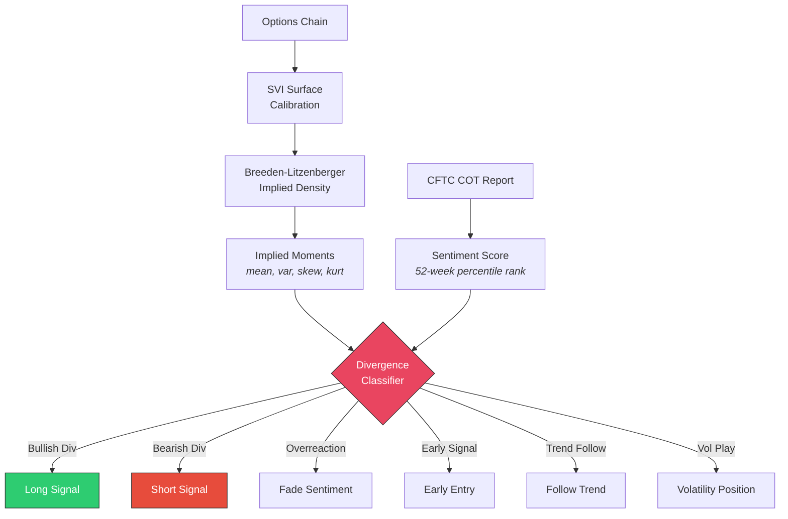

# HYDRA

**Heuristic Yield-Driven Recursive Agent**

*Cut off one head (model breaks), two grow back (self-healing).*

An autonomous trading model improvement system for thin commodity futures markets. HYDRA detects when its own trading model degrades, diagnoses root causes, generates and tests improvement hypotheses, and promotes better models -- all without human intervention. It exploits the divergence between options-implied market expectations and CFTC sentiment positioning in thin commodity markets where institutional quants don't compete.

[](https://www.python.org/downloads/)
[](LICENSE)
[](#testing)

---

## Architecture



### Self-Healing Loop

The core of HYDRA -- when the model degrades, the agent loop kicks in:



### Divergence Signal Flow

How HYDRA detects and classifies options-sentiment divergences:



## The Core Thesis

Options markets encode forward-looking expectations through implied distributions. CFTC positioning data reveals crowd sentiment with a known lag. When these two signals diverge, one of them is wrong -- and options markets are right more often in thin commodity markets where positioning data reflects a small number of large players.

HYDRA classifies these divergences into 6 types and trades accordingly:

| Type | Options Say | Crowd Says | Action |
|------|-----------|-----------|--------|
| Bullish Divergence | Price up | Bearish | Long |
| Bearish Divergence | Price down | Bullish | Short |
| Sentiment Overreaction | Neutral | Strong signal | Fade sentiment |
| Early Signal | Directional + skew shift | No opinion yet | Early entry |
| Trend Follow | Both aligned | Both aligned | Follow trend |
| Volatility Play | High kurtosis, flat mean | Any | Vol position |

## Project Status

| Phase | Description | Status |
|-------|------------|--------|
| 1. Data Infrastructure | Ingestion, feature store, options math | Complete |
| 2. Signal Layer | Divergence signals, LightGBM baseline, backtesting | Complete |
| 3. Sandbox | Market replay, model registry, drift detection, CLI | In Progress |
| 4. Agent Core | LLM-powered self-healing loop | Planned |
| 5. Execution | IB paper trading, order management, risk middleware | Planned |

**Validation Gates:**
- Phase 1: Can Breeden-Litzenberger produce stable implied distributions from thin-market options?
- Phase 2: Does the divergence signal predict price movement OOS with Sharpe > 0 after slippage?
- Phase 5: 4+ weeks stable paper trading with at least one successful self-healing cycle

## Quick Start

### Prerequisites

- Python 3.11+
- [uv](https://docs.astral.sh/uv/) package manager
- macOS or Linux

### Installation

```bash
git clone https://github.com/001TMF/HYDRA.git
cd HYDRA
uv sync
```

### Run Tests

```bash
uv run pytest tests/ -v
```

### Project Structure

```
src/hydra/
├── data/                          # Phase 1: Data Infrastructure
│   ├── ingestion/
│   │   ├── base.py                # Base ingestion pipeline
│   │   ├── futures.py             # Futures OHLCV ingestion
│   │   ├── options.py             # Options chain ingestion
│   │   └── cot.py                 # CFTC COT reports
│   ├── store/
│   │   ├── feature_store.py       # Point-in-time correct queries
│   │   └── parquet_lake.py        # Append-only Parquet storage
│   └── quality.py                 # Data staleness & anomaly detection
│
├── signals/                       # Phase 1+2: Signal Generation
│   ├── options_math/
│   │   ├── surface.py             # SVI volatility surface calibration
│   │   ├── density.py             # Breeden-Litzenberger implied density
│   │   ├── moments.py             # Implied moments (mean, var, skew, kurt)
│   │   └── greeks.py              # Greeks flow aggregation (GEX, vanna, charm)
│   ├── sentiment/
│   │   └── cot_scoring.py         # COT sentiment score [-1, +1]
│   └── divergence/
│       └── detector.py            # 6-type divergence taxonomy
│
├── model/                         # Phase 2: Model Layer
│   ├── features.py                # 17-feature matrix assembler
│   ├── baseline.py                # LightGBM binary classifier
│   ├── walk_forward.py            # Purged walk-forward backtesting
│   └── evaluation.py              # Backtest metrics (Sharpe, drawdown, etc.)
│
├── risk/                          # Phase 2: Risk Management
│   ├── slippage.py                # Volume-adaptive square-root impact model
│   ├── position_sizing.py         # Fractional Kelly + volume cap
│   └── circuit_breakers.py        # 4-breaker state machine
│
├── sandbox/                       # Phase 3: Experiment Infrastructure (WIP)
└── cli/                           # Phase 3: Operator CLI (WIP)
```

## Tech Stack

| Component | Technology | Why |
|-----------|-----------|-----|
| Language | Python 3.11+ | Ecosystem for quant finance + ML |
| Package Manager | uv | Fast, reliable dependency resolution |
| ML Model | LightGBM | CPU-optimized, handles NaN natively, proven in competitions |
| Options Math | NumPy + SciPy | SVI calibration, B-L density extraction, Greeks |
| Data Storage | Parquet (append-only) | Columnar, fast reads, Hive partitioned |
| Feature Store | SQLite + WAL mode | Point-in-time queries, TimescaleDB-ready schema |
| Model Registry | MLflow | Champion/candidate lifecycle tracking |
| CLI | Typer + Rich | Beautiful terminal output with tables and colors |
| Agent LLM | DeepSeek-R1 (via Together AI) | Structured reasoning for diagnosis + hypothesis |

**Explicitly not using:** LangChain, LangGraph, Airflow, Kubernetes, Feast, GPU infrastructure.

## Key Design Decisions

- **LLM never touches the prediction hot path** -- it proposes hypotheses, deterministic code executes them
- **Volume-adaptive slippage, not fixed** -- square-root impact model mandatory for thin markets
- **Walk-forward with embargo gaps** -- no random cross-validation on time series, ever
- **Fractional Kelly (half-Kelly)** -- aggressive Kelly sizing is mathematically optimal but practically suicidal
- **Circuit breakers with cooldown** -- ACTIVE -> TRIGGERED -> COOLDOWN -> ACTIVE state machine prevents permanent halts
- **No hyperparameter tuning in baseline** -- conservative defaults only; tuning belongs in the experiment loop

## Contributing

Contributions are welcome! HYDRA is an ambitious project and there's plenty to work on.

### Getting Started

1. **Fork the repo** and clone your fork
2. **Install dependencies:**
   ```bash
   uv sync
   ```
3. **Run the test suite** to make sure everything works:
   ```bash
   uv run pytest tests/ -v
   ```
4. **Create a feature branch:**
   ```bash
   git checkout -b feature/your-feature-name
   ```
5. **Make your changes** with tests
6. **Submit a PR** against `main`

### Development Guidelines

- **Tests required** -- every new module needs tests. TDD preferred (write tests first).
- **No new files without reuse analysis** -- check if existing code can be extended first.
- **Type hints** -- use them on public APIs.
- **Keep it simple** -- no over-engineering. If three lines of code work, don't write an abstraction.
- **Respect the dependency chain** -- Phase N modules only import from Phase N and earlier.

### Areas for Contribution

| Area | Difficulty | Description |
|------|-----------|-------------|
| Data vendors | Medium | Add ingestion pipelines for new data sources |
| Market support | Medium | Extend to additional commodity futures markets |
| Drift detectors | Easy | Add new statistical drift detection methods |
| CLI commands | Easy | Add new Rich-formatted operator commands |
| Documentation | Easy | Improve docstrings and usage examples |
| Backtest metrics | Medium | Add new evaluation metrics to the backtest engine |
| Performance | Hard | Optimize walk-forward engine for large datasets |

### Code of Conduct

Be respectful, be constructive, be kind. We're all here to build something cool.

## License

[MIT](LICENSE) - see the [LICENSE](LICENSE) file for details.

## Acknowledgments

- Options math methodology: Breeden & Litzenberger (1978), Gatheral (2004) SVI parameterization
- Walk-forward methodology: Lopez de Prado, "Advances in Financial Machine Learning" (2018)
- Slippage model: Almgren & Chriss (2001) square-root impact model
- Position sizing: Thorp (2006) fractional Kelly criterion
