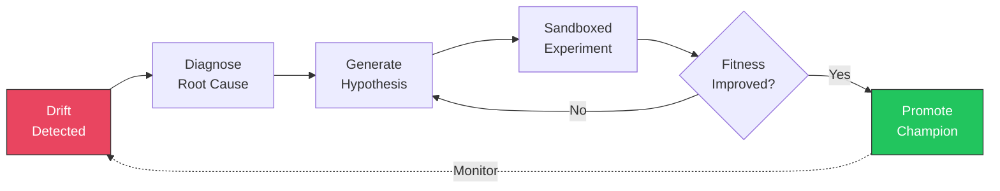
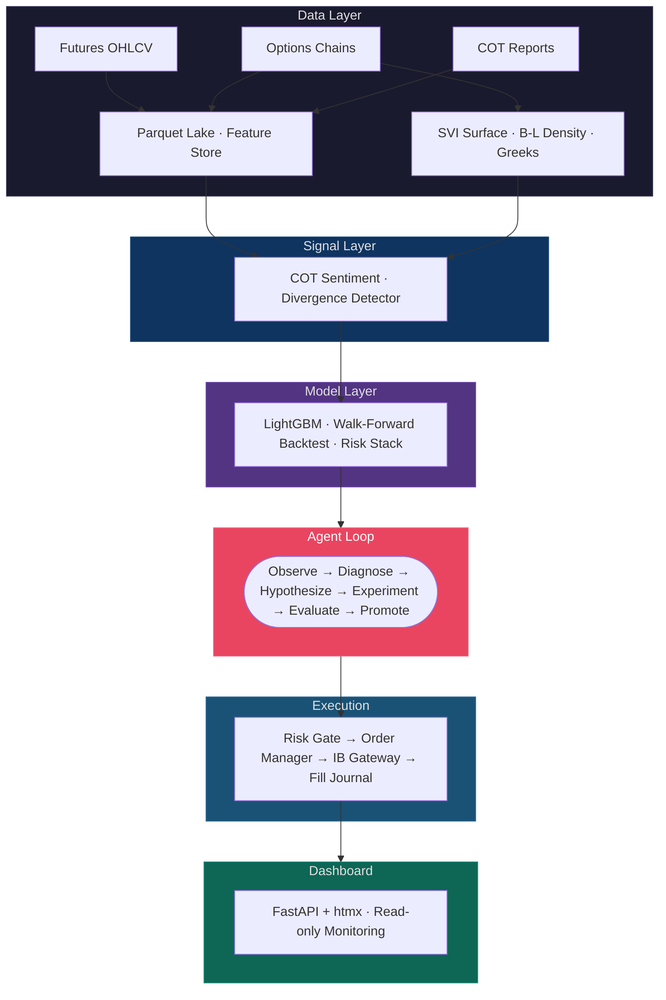

<p align="center">
  <h1 align="center">HYDRA</h1>
  <p align="center">
    <strong>Heuristic Yield-Driven Recursive Agent</strong>
    <br />
    <em>Cut off one head, two grow back.</em>
  </p>
  <p align="center">
    <a href="https://www.python.org/downloads/"></a>
    <a href="LICENSE"></a>
    <a href="#testing"></a>
    <a href="#paper-trading-results"></a>
  </p>
</p>

An autonomous trading system that **detects its own model degradation, diagnoses root causes, generates improvement hypotheses, and promotes better models** -- without human intervention.

HYDRA exploits the divergence between options-implied expectations and CFTC sentiment positioning in thin commodity futures markets where institutional quants don't compete.

<br />

## How It Works

```
Options Chain ──► SVI Surface ──► Implied Density ──► Implied Moments ─┐
                                                                       ├──► Divergence ──► Signal
CFTC COT Report ──────────────► Sentiment Score ───────────────────────┘
```

Options markets price in forward-looking expectations. CFTC positioning data reveals crowd sentiment with a known lag. When these two signals **diverge**, one of them is wrong -- and in thin commodity markets, options are right more often.

HYDRA classifies divergences into 6 types:

| | Type | Options Say | Crowd Says | Trade |
|---|------|-----------|-----------|-------|
| 1 | **Bullish Divergence** | Price up | Bearish | Long |
| 2 | **Bearish Divergence** | Price down | Bullish | Short |
| 3 | **Overreaction** | Neutral | Extreme signal | Fade sentiment |
| 4 | **Early Signal** | Skew shift | No opinion yet | Early entry |
| 5 | **Trend Follow** | Aligned | Aligned | Follow trend |
| 6 | **Vol Play** | High kurtosis | Any | Vol position |

When the model degrades, the self-healing loop activates:



The LLM (DeepSeek-R1) **never touches the prediction hot path** -- it proposes hypotheses for ambiguous diagnoses. Deterministic code executes everything. The system runs at zero token cost by default.

<br />

## Paper Trading Results

> Paper trading validation in progress. Results will be populated as data accumulates.
> Minimum 4 weeks required before any live capital.

### Performance

| Metric | Value | Target |
|--------|-------|--------|
| Paper Trading Days | -- | 28+ |
| OOS Sharpe (slippage-adj) | -- | > 0 |
| Max Drawdown | -- | < 15% |
| Win Rate | -- | > 50% |
| Total Fills | -- | -- |
| Avg Slippage (bps) | -- | -- |

### Slippage Reconciliation

| Metric | Value | Gate |
|--------|-------|------|
| Bias (predicted - actual) | -- | abs < 0.5 |
| RMSE | -- | -- |
| Correlation | -- | > 0.3 |
| Pessimism Multiplier | -- | -- |

### Self-Healing Cycles

| # | Date | Drift Type | Diagnosis | Mutation | Outcome |
|---|------|-----------|-----------|----------|---------|
| -- | -- | -- | -- | -- | -- |

*At least 1 successful cycle required: drift detected, hypothesis generated, experiment run, promotion or rollback.*

### Gate Checklist

- [ ] 28+ days continuous paper trading
- [ ] Slippage model calibrated (bias < 0.5, corr > 0.3)
- [ ] At least 1 complete self-healing cycle
- [ ] Zero unrecoverable errors
- [ ] Circuit breakers verified
- [ ] Auto-reconnection verified

<br />

## Architecture



<br />

## Quick Start

```bash
git clone https://github.com/001TMF/HYDRA.git
cd HYDRA
uv sync                          # Install dependencies
uv run pytest tests/ -v          # Run 569 tests
```

**Requirements:** Python 3.11+, [uv](https://docs.astral.sh/uv/), macOS or Linux

### CLI

```bash
hydra status                     # System health + champion metrics
hydra diagnose                   # Drift detection report
hydra rollback                   # Revert to previous champion
hydra pause / run                # Pause or resume agent loop
hydra journal                    # Query experiment history
hydra paper-trade start          # Start paper trading
hydra fill-report                # Fills + slippage reconciliation
hydra serve                      # Monitoring dashboard on :8080
```

### Docker

```bash
cd docker
cp .env.example .env             # Add your IB credentials
docker compose up -d             # Starts IB Gateway + HYDRA
```

Runs the full stack: headless [IB Gateway](https://github.com/gnzsnz/ib-gateway-docker) (paper) + HYDRA (dashboard + runner). All ports localhost-only.

<br />

## Project Structure

```
src/hydra/
├── data/               Ingestion pipelines, Parquet lake, feature store, data quality
├── signals/            SVI surface, B-L density, Greeks, COT sentiment, divergence detector
├── model/              LightGBM baseline, feature assembler, walk-forward backtester
├── risk/               Slippage model, Kelly sizing, circuit breakers
├── sandbox/            Market replay, MLflow registry, experiment journal, drift detectors
├── agent/              Self-healing loop, diagnostician, hypothesis engine, LLM client
├── execution/          IB broker gateway, risk gate, order manager, fill journal
├── dashboard/          FastAPI + Jinja2 + htmx monitoring (5 pages, SSE live updates)
├── cli/                Typer + Rich terminal interface (9 commands)
└── config/             Market definitions & thresholds
```

<details>
<summary><strong>Expanded structure</strong></summary>

```
src/hydra/
├── data/
│   ├── ingestion/
│   │   ├── futures.py               Futures OHLCV via Databento
│   │   ├── options.py               Options chain (MBP-1, definitions, statistics)
│   │   └── cot.py                   CFTC COT with as-of date handling
│   ├── store/
│   │   ├── parquet_lake.py          Append-only, Hive partitioned, UUID filenames
│   │   └── feature_store.py         Point-in-time correct, no lookahead bias
│   └── quality.py                   Staleness detection, 3-tier health status
│
├── signals/
│   ├── options_math/
│   │   ├── surface.py               SVI calibration (L-BFGS-B, ftol=1e-14)
│   │   ├── density.py               Breeden-Litzenberger with 200-pt fine grid
│   │   ├── moments.py               Mean, variance, skew, kurtosis from density
│   │   └── greeks.py                GEX, vanna, charm flow aggregation
│   ├── sentiment/
│   │   └── cot_scoring.py           52-week percentile rank, [-1, +1] normalized
│   └── divergence/
│       └── detector.py              6-type taxonomy, priority-ordered classification
│
├── model/
│   ├── features.py                  17-feature matrix, NaN preserved for LightGBM
│   ├── baseline.py                  LightGBM binary, conservative defaults
│   ├── walk_forward.py              Purged CV with embargo, no lookahead
│   └── evaluation.py                Sharpe, Sortino, Calmar, drawdown, hit rate
│
├── risk/
│   ├── slippage.py                  Square-root impact (Almgren-Chriss)
│   ├── position_sizing.py           Half-Kelly with volume cap
│   └── circuit_breakers.py          4 independent breakers with cooldown FSM
│
├── sandbox/
│   ├── replay.py                    Market replay with observer callbacks
│   ├── registry.py                  MLflow: champion/candidate/archived lifecycle
│   ├── journal.py                   SQLite experiment log, queryable by tag/date/type
│   ├── observer.py                  Rolling perf + feature drift monitoring
│   ├── evaluator.py                 6-metric weighted composite fitness
│   └── drift/                       PSI, KS test, CUSUM, ADWIN (via river)
│
├── agent/
│   ├── loop.py                      State machine: observe→diagnose→hypothesize→experiment→evaluate
│   ├── diagnostician.py             Rule-based triage (feature/perf/regime/overfit)
│   ├── hypothesis.py                Mutation playbook: retune, mutate features, swap model
│   ├── experiment_runner.py         Subprocess isolation per experiment
│   ├── llm/client.py               DeepSeek-R1 → Qwen2.5 → rules fallback chain
│   ├── autonomy.py                  4 levels: supervised → semi → auto → lockdown
│   ├── rollback.py                  Hysteresis trigger on sustained degradation
│   ├── promotion.py                 3-of-5 independent window evaluator
│   ├── dedup.py                     Embedding similarity > 0.85 = reject
│   └── budget.py                    Per-cycle mutation budget + cooldown timers
│
├── execution/
│   ├── broker.py                    ib_async wrapper, exponential backoff reconnect
│   ├── risk_gate.py                 Mandatory pre-trade middleware (no bypass)
│   ├── order_manager.py             Limit-patience escalation + thin-market TWAP
│   ├── fill_journal.py              SQLite WAL, slippage tracking per fill
│   ├── reconciler.py                Predicted vs actual slippage stats
│   └── runner.py                    APScheduler daily cycle + delayed IB data
│
├── dashboard/
│   ├── app.py                       FastAPI factory, lifespan runner integration
│   ├── routes/{pages,api,sse}.py    5 HTML pages, JSON/fragment APIs, SSE stream
│   ├── templates/                   Jinja2 with htmx hx-trigger="every 60s"
│   └── static/style.css             Dark theme, status indicators
│
├── cli/
│   ├── app.py                       9 Typer commands with Rich panels/tables
│   ├── formatters.py                Rich renderables (Table, Panel)
│   └── state.py                     PAUSED/RUNNING file-based state
│
└── config/
    └── default.yaml                 Market specs, quality thresholds, data sources
```

</details>

<br />

## Tech Stack

| | Technology | Role |
|---|-----------|------|
| **Core** | Python 3.11+, uv | Language + package management |
| **ML** | LightGBM, scikit-learn | Prediction model + evaluation |
| **Math** | NumPy, SciPy | SVI surfaces, B-L density, Greeks |
| **Data** | Parquet, SQLite WAL, Databento | Storage + ingestion |
| **Tracking** | MLflow | Model registry + experiment lifecycle |
| **Drift** | river, SciPy | ADWIN, CUSUM, PSI, KS test |
| **LLM** | DeepSeek-R1 via Together AI | Optional diagnosis enhancement |
| **Broker** | ib-async 2.1.0 | Interactive Brokers API |
| **Web** | FastAPI, Jinja2, htmx | Dashboard (no npm, no SPA) |
| **Ops** | Docker Compose, APScheduler | Containerisation + scheduling |
| **CLI** | Typer, Rich | Terminal interface |

**Not using:** LangChain, LangGraph, Airflow, Kubernetes, Feast, GPU infrastructure.

<br />

## Design Principles

| Principle | Implementation |
|-----------|---------------|
| **LLM off the hot path** | LLM proposes hypotheses; deterministic code executes. Zero tokens by default. |
| **No live capital without proof** | 4+ weeks paper trading, calibrated slippage, successful self-heal required. |
| **Thin-market aware** | Square-root slippage, volume caps, patience-based order routing. |
| **Conservative promotion** | Candidate beats champion in 3 of 5 independent evaluation windows. |
| **Graceful degradation** | < 8 strikes = ATM vol fallback. Missing data = neutral signal. DB down = dashboard still serves. |
| **No random CV on time series** | Walk-forward only, with purged embargo gaps. |
| **Circuit breakers, not kill switches** | ACTIVE -> TRIGGERED -> COOLDOWN -> ACTIVE. System recovers automatically. |

<br />

## Testing

```bash
uv run pytest tests/ -v                        # All 569 tests
uv run pytest tests/test_density.py -v          # Options math
uv run pytest tests/test_walk_forward.py -v     # Backtesting
uv run pytest tests/test_agent_loop.py -v       # Agent loop
uv run pytest tests/test_dashboard_*.py -v      # Dashboard (22 tests)
```

<br />

## Contributing

1. Fork + clone
2. `uv sync` to install
3. `uv run pytest tests/ -v` to verify
4. Branch, build with tests, PR against `main`

**Guidelines:** Tests required. No new files without reuse analysis. Type hints on public APIs. Respect the dependency chain (Phase N imports from Phase N and earlier only).

| Area | Difficulty |
|------|-----------|
| Data vendor pipelines | Medium |
| New commodity markets | Medium |
| Drift detection methods | Easy |
| Dashboard views | Easy |
| Multi-head agent (AGNT-11-18) | Hard |

<br />

## References

- Breeden & Litzenberger (1978) -- implied density extraction from option prices
- Gatheral (2004) -- SVI volatility surface parameterization
- Lopez de Prado (2018) -- walk-forward methodology, purged cross-validation
- Almgren & Chriss (2001) -- square-root market impact model
- Thorp (2006) -- fractional Kelly criterion for position sizing

<br />

## License

[MIT](LICENSE)
