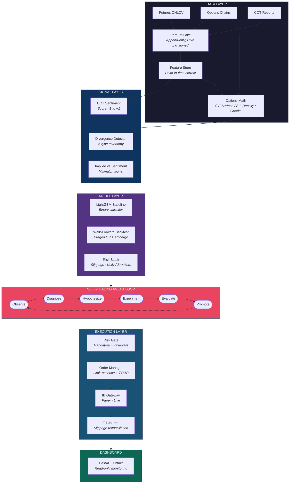
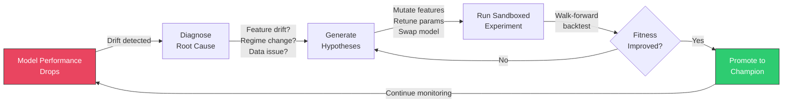
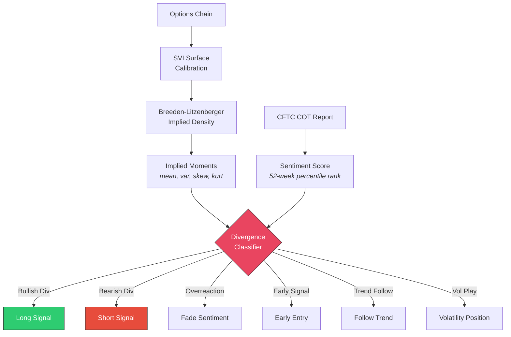

# HYDRA

**Heuristic Yield-Driven Recursive Agent**

*Cut off one head (model breaks), two grow back (self-healing).*

An autonomous trading model improvement system for thin commodity futures markets. HYDRA detects when its own trading model degrades, diagnoses root causes, generates and tests improvement hypotheses, and promotes better models -- all without human intervention. It exploits the divergence between options-implied market expectations and CFTC sentiment positioning in thin commodity markets where institutional quants don't compete.

[](https://www.python.org/downloads/)
[](LICENSE)
[](#testing)

---

## Architecture



### Self-Healing Loop

The core of HYDRA -- when the model degrades, the agent loop kicks in:



### Divergence Signal Flow

How HYDRA detects and classifies options-sentiment divergences:



## The Core Thesis

Options markets encode forward-looking expectations through implied distributions. CFTC positioning data reveals crowd sentiment with a known lag. When these two signals diverge, one of them is wrong -- and options markets are right more often in thin commodity markets where positioning data reflects a small number of large players.

HYDRA classifies these divergences into 6 types and trades accordingly:

| Type | Options Say | Crowd Says | Action |
|------|-----------|-----------|--------|
| Bullish Divergence | Price up | Bearish | Long |
| Bearish Divergence | Price down | Bullish | Short |
| Sentiment Overreaction | Neutral | Strong signal | Fade sentiment |
| Early Signal | Directional + skew shift | No opinion yet | Early entry |
| Trend Follow | Both aligned | Both aligned | Follow trend |
| Volatility Play | High kurtosis, flat mean | Any | Vol position |

## Project Status

All 6 phases complete. 30 plans executed across 6 phases. 569 tests passing.

| Phase | Description | Status |
|-------|------------|--------|
| 1. Data Infrastructure | Ingestion, feature store, options math (SVI, B-L, Greeks) | Complete |
| 2. Signal Layer | Divergence signals, LightGBM baseline, walk-forward backtesting | Complete |
| 3. Sandbox | Market replay, model registry, drift detection, experiment journal, CLI | Complete |
| 4. Agent Core | Autonomous self-healing loop with LLM-powered diagnosis | Complete |
| 5. Execution | IB paper trading, order management, risk middleware | Complete |
| 6. Dashboard | FastAPI monitoring dashboard, Docker containerisation | Complete |

**Validation Gates:**
- **Phase 1:** Can Breeden-Litzenberger produce stable implied distributions from thin-market options?
- **Phase 2:** Does the divergence signal predict price movement OOS with Sharpe > 0 after slippage?
- **Phase 5:** 4+ weeks stable paper trading with at least one successful self-healing cycle

**Next:** 4-week paper trading validation period before any live capital.

## Quick Start

### Prerequisites

- Python 3.11+
- [uv](https://docs.astral.sh/uv/) package manager
- macOS or Linux

### Installation

```bash
git clone https://github.com/001TMF/HYDRA.git
cd HYDRA
uv sync
```

### Run Tests

```bash
uv run pytest tests/ -v
```

### CLI

HYDRA ships with a Typer CLI for system operation:

```bash
uv run hydra status              # System health, champion metrics, alerts
uv run hydra diagnose            # Run drift detection on champion model
uv run hydra rollback            # Revert champion to previous version
uv run hydra pause               # Pause the agent loop
uv run hydra run                 # Resume the agent loop
uv run hydra journal             # Query experiment history
uv run hydra paper-trade start   # Start paper trading runner
uv run hydra fill-report         # View fills and slippage reconciliation
uv run hydra serve               # Start monitoring dashboard
```

### Dashboard

Start the read-only monitoring dashboard:

```bash
uv run hydra serve --port 8080
```

Opens a FastAPI + htmx dashboard at `http://localhost:8080` with 5 pages:
- **Overview** -- fill count, agent state, SSE live cycle updates
- **Fills** -- fill journal table with slippage reconciliation
- **Agent** -- experiment history and agent loop status
- **Drift** -- monitored metrics (Sharpe, drawdown, PSI, KS, ADWIN, CUSUM)
- **System** -- database health, broker status, configuration

All pages auto-refresh via htmx every 60 seconds.

### Docker Deployment

Run the full stack (HYDRA + IB Gateway) via Docker Compose:

```bash
cd docker
cp .env.example .env
# Edit .env with your IB credentials
docker compose up -d
```

This starts:
- **ib-gateway** -- headless IB Gateway ([gnzsnz/ib-gateway](https://github.com/gnzsnz/ib-gateway-docker)) on paper trading port
- **hydra** -- dashboard + paper trading runner in a single container

Dashboard available at `http://localhost:8080`. All ports bound to localhost only.

## Project Structure

```
src/hydra/
├── data/                          # Data Infrastructure
│   ├── ingestion/
│   │   ├── futures.py             # Futures OHLCV ingestion
│   │   ├── options.py             # Options chain ingestion
│   │   └── cot.py                 # CFTC COT reports
│   ├── store/
│   │   ├── feature_store.py       # Point-in-time correct queries
│   │   └── parquet_lake.py        # Append-only Parquet storage
│   └── quality.py                 # Data staleness & anomaly detection
│
├── signals/                       # Signal Generation
│   ├── options_math/
│   │   ├── surface.py             # SVI volatility surface calibration
│   │   ├── density.py             # Breeden-Litzenberger implied density
│   │   ├── moments.py             # Implied moments (mean, var, skew, kurt)
│   │   └── greeks.py              # Greeks flow (GEX, vanna, charm)
│   ├── sentiment/
│   │   └── cot_scoring.py         # COT sentiment score [-1, +1]
│   └── divergence/
│       └── detector.py            # 6-type divergence taxonomy
│
├── model/                         # Model Layer
│   ├── features.py                # 17-feature matrix assembler
│   ├── baseline.py                # LightGBM binary classifier
│   ├── walk_forward.py            # Purged walk-forward backtesting
│   └── evaluation.py              # Backtest metrics (Sharpe, drawdown, etc.)
│
├── risk/                          # Risk Management
│   ├── slippage.py                # Volume-adaptive square-root impact
│   ├── position_sizing.py         # Fractional Kelly + volume cap
│   └── circuit_breakers.py        # 4-breaker state machine
│
├── sandbox/                       # Experiment Infrastructure
│   ├── replay.py                  # Market replay with volume-adaptive slippage
│   ├── registry.py                # MLflow model registry (champion/candidate)
│   ├── journal.py                 # Experiment journal (SQLite)
│   ├── observer.py                # DriftObserver (perf + feature drift)
│   ├── evaluator.py               # Composite fitness scorer (6 metrics)
│   └── drift/                     # PSI, KS, CUSUM, ADWIN detectors
│
├── agent/                         # Self-Healing Agent Loop
│   ├── loop.py                    # Observe-diagnose-hypothesize-experiment-evaluate
│   ├── diagnostician.py           # Rule-based structured triage
│   ├── hypothesis.py              # Mutation playbook
│   ├── experiment_runner.py       # Subprocess isolation for experiments
│   ├── llm/
│   │   └── client.py              # DeepSeek-R1 with fallback chain
│   ├── autonomy.py                # Permission gating (4 levels)
│   ├── rollback.py                # Hysteresis rollback trigger
│   ├── promotion.py               # 3-of-5 window promotion evaluator
│   ├── dedup.py                   # Semantic dedup (embedding similarity)
│   └── budget.py                  # Mutation budgets & cooldowns
│
├── execution/                     # IB Paper Trading
│   ├── broker.py                  # BrokerGateway (ib_async wrapper)
│   ├── risk_gate.py               # Mandatory pre-trade circuit breakers
│   ├── order_manager.py           # Smart routing (limit-patience + TWAP)
│   ├── fill_journal.py            # SQLite fill logging + slippage
│   ├── reconciler.py              # Predicted vs actual slippage
│   └── runner.py                  # Daily cycle orchestrator (APScheduler)
│
├── dashboard/                     # Monitoring Dashboard
│   ├── app.py                     # FastAPI factory + lifespan runner
│   ├── routes/
│   │   ├── pages.py               # 5 page routes (Jinja2)
│   │   ├── api.py                 # JSON + htmx fragment endpoints
│   │   └── sse.py                 # Server-sent events
│   ├── templates/                 # Jinja2 templates (htmx auto-refresh)
│   └── static/                    # Dark theme CSS
│
├── cli/                           # Operator CLI
│   ├── app.py                     # Typer app (9 commands)
│   ├── formatters.py              # Rich table formatting
│   └── state.py                   # Agent state management
│
└── config/                        # Configuration
    └── default.yaml               # Market definitions & thresholds
```

## Tech Stack

| Component | Technology | Why |
|-----------|-----------|-----|
| Language | Python 3.11+ | Ecosystem for quant finance + ML |
| Package Manager | uv | Fast, reliable dependency resolution |
| ML Model | LightGBM | CPU-optimized, handles NaN natively, proven |
| Options Math | NumPy + SciPy | SVI calibration, B-L density, Greeks |
| Data Storage | Parquet (append-only) | Columnar, fast reads, Hive partitioned |
| Feature Store | SQLite + WAL mode | Point-in-time queries, TimescaleDB-ready schema |
| Model Registry | MLflow | Champion/candidate lifecycle tracking |
| Drift Detection | river + SciPy | ADWIN, CUSUM, PSI, KS test |
| Scheduling | APScheduler | Daily cycle orchestration |
| Agent LLM | DeepSeek-R1 (via Together AI) | Structured reasoning for diagnosis + hypothesis |
| LLM Framework | OpenAI SDK + instructor | Pydantic-validated structured output |
| Broker API | ib-async 2.1.0 | Interactive Brokers paper/live trading |
| CLI | Typer + Rich | Terminal output with tables and colors |
| Dashboard | FastAPI + Jinja2 + htmx | Read-only monitoring (no SPA, no npm) |
| Containerisation | Docker Compose | HYDRA + IB Gateway stack |

**Explicitly not using:** LangChain, LangGraph, Airflow, Kubernetes, Feast, GPU infrastructure.

## Key Design Decisions

- **LLM never touches the prediction hot path** -- it proposes hypotheses, deterministic code executes them
- **Zero-cost default** -- system runs entirely rule-based; LLM is optional enhancement for ambiguous diagnosis
- **Volume-adaptive slippage, not fixed** -- square-root impact model mandatory for thin markets
- **Walk-forward with embargo gaps** -- no random cross-validation on time series, ever
- **Fractional Kelly (half-Kelly)** -- aggressive Kelly sizing is mathematically optimal but practically suicidal
- **Circuit breakers with cooldown** -- ACTIVE -> TRIGGERED -> COOLDOWN -> ACTIVE state machine prevents permanent halts
- **3-of-5 promotion** -- candidate must beat champion across 3 of 5 independent evaluation windows
- **Hysteresis rollback** -- sustained degradation triggers rollback; transient dips are tolerated
- **Semantic dedup** -- embedding similarity > 0.85 rejects duplicate hypotheses
- **Single process for dashboard + runner** -- SQLite WAL safety, no cross-container DB access
- **No live capital without gate** -- 4+ weeks paper trading with successful self-healing cycle required

## Testing

569 tests across 47 test files covering:

```bash
# Run all tests
uv run pytest tests/ -v

# Run specific module tests
uv run pytest tests/test_density.py -v      # Options math
uv run pytest tests/test_walk_forward.py -v  # Backtesting
uv run pytest tests/test_agent_loop.py -v    # Agent loop
uv run pytest tests/test_dashboard_*.py -v   # Dashboard
```

## Contributing

Contributions are welcome! HYDRA is an ambitious project and there's plenty to work on.

### Getting Started

1. **Fork the repo** and clone your fork
2. **Install dependencies:**
   ```bash
   uv sync
   ```
3. **Run the test suite** to make sure everything works:
   ```bash
   uv run pytest tests/ -v
   ```
4. **Create a feature branch:**
   ```bash
   git checkout -b feature/your-feature-name
   ```
5. **Make your changes** with tests
6. **Submit a PR** against `main`

### Development Guidelines

- **Tests required** -- every new module needs tests. TDD preferred (write tests first).
- **No new files without reuse analysis** -- check if existing code can be extended first.
- **Type hints** -- use them on public APIs.
- **Keep it simple** -- no over-engineering. If three lines of code work, don't write an abstraction.
- **Respect the dependency chain** -- Phase N modules only import from Phase N and earlier.

### Areas for Contribution

| Area | Difficulty | Description |
|------|-----------|-------------|
| Data vendors | Medium | Add ingestion pipelines for new data sources |
| Market support | Medium | Extend to additional commodity futures markets |
| Drift detectors | Easy | Add new statistical drift detection methods |
| CLI commands | Easy | Add new Rich-formatted operator commands |
| Dashboard pages | Easy | New monitoring views or enhanced visualizations |
| Multi-head agent | Hard | Competing diagnostic heads (deferred AGNT-11-18) |
| Backtest metrics | Medium | Add new evaluation metrics to the backtest engine |
| Performance | Hard | Optimize walk-forward engine for large datasets |

### Code of Conduct

Be respectful, be constructive, be kind. We're all here to build something cool.

## License

[MIT](LICENSE) - see the [LICENSE](LICENSE) file for details.

## Acknowledgments

- Options math methodology: Breeden & Litzenberger (1978), Gatheral (2004) SVI parameterization
- Walk-forward methodology: Lopez de Prado, "Advances in Financial Machine Learning" (2018)
- Slippage model: Almgren & Chriss (2001) square-root impact model
- Position sizing: Thorp (2006) fractional Kelly criterion
